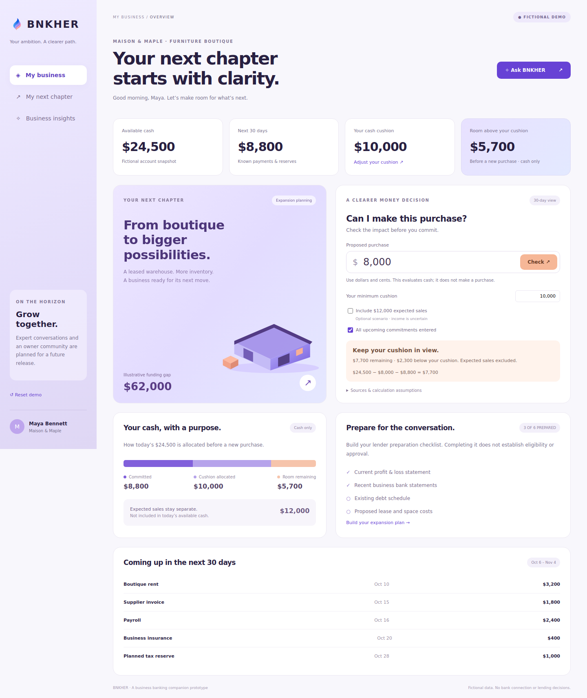

# BNKHER
**Your ambition. A clearer path.**

[Try the public BNKHER demo](https://cmcgh33.github.io/bnkher-business-companion./web/) · Fictional data, with a rule-based assistant.

[Watch the real AI walkthrough (28 seconds)](design/live-ai-walkthrough.mp4) · No access code needed to watch. Captioned screen captures show an actual OpenAI-powered, four-tool response using fictional data, recorded October 6, 2026.

**Version 0.3:** a bounded read-only tool workflow is available in demo mode and implemented for the private AI backend. [Agent contracts and evaluation](docs/agent-workflow.md) · [Product and delivery plan](docs/delivery-plan.md).

**AI activation:** the access-controlled OpenAI backend is active in a private Replit development preview and passed the real-provider evaluations described below. [Activation guide](docs/hosting.md).

A business banking companion prototype for an owner planning her next chapter. BNKHER helps a fictional furniture boutique understand its cash position, evaluate an inventory purchase, and prepare for a leased-warehouse expansion.



## Experience
- **My business:** available cash, a user-chosen cushion, 30-day commitments, and an explainable purchase scenario.
- **My next chapter:** editable expansion budget, owner contribution, funding gap, an illustrative payment, and a document checklist.
- **Business insights:** receipt review prompts and an explicit “not connected” business credit state.
- **Ask BNKHER:** typed demo questions, optional access-controlled AI interpretation, browser speech input, and optional spoken replies.

## Quick preview
Run `python3 build_preview.py`, then double-click the generated **BNKHER-Preview.html** to open the self-contained review copy in your browser. It includes the full interface and demo calculations. Voice features depend on your browser and may need a secure hosted page.

## Run locally
Requires Node 20 or later for the full backend. No API key is needed to run demo mode.

```bash
npm start
```
Open **http://localhost:3000**. Private server secrets enable optional live AI; see the activation guide.

For the static demo only, Python 3 is enough:

```bash
python3 -m http.server 8000 --bind 127.0.0.1 --directory web
```
Open **http://127.0.0.1:8000**. Keep the terminal running. Opening `index.html` directly will not load the JavaScript modules reliably.

## Try this journey
1. Start with the default $8,000 purchase: $24,500 − $8,000 − $8,800 = **$7,700 remaining**, which is **$2,300 below** the $10,000 cushion.
2. Include expected sales to inspect a separate scenario. These sales are uncertain and excluded by default.
3. Mark commitments incomplete: the result asks for more information.
4. For a compound scenario, select **Use multistep workflow** in Ask BNKHER and choose **Inventory + expansion workflow**. Demo mode uses a fixed planner; live mode requires the private backend.
5. Open **Ask BNKHER** and ask “Can I buy $8,000 in inventory?”
6. Open **My next chapter**, adjust the project budget and mark documents prepared.
7. Use **Reset demo** to restore the example. Input changes remain only in the page session.

## Validation
```bash
node --test tests/*.test.mjs
```
The browser integration check requires Python Playwright and its Chromium browser:
```bash
python3 tests/browser_check.py
```
The updated copy passed 29 financial/intent/workflow/backend tests (provider calls injected). Earlier v0.2 desktop/mobile checks covered purchase scenarios, incomplete data, assistant, checklist, budget and reset. The updated desktop/mobile browser workflow passed in [GitHub CI](https://github.com/cmcgh33/bnkher-business-companion./actions/runs/37510173780), covering the four-tool compound scenario and its financial boundaries. The run includes downloadable screenshots.

## Scope and status
This is a working frontend and backend prototype with a deterministic calculation engine, a **rule-based demo assistant**, and an optional **AI interpretation layer**. The public GitHub Pages site remains demo mode; live AI is configured in an access-code-protected Replit development preview. On October 6, 2026, all 8 real-provider interpretation cases and all 8 real-provider agent cases passed using `gpt-5.4-mini-2026-03-17`. This is a small evaluation set, not a guarantee of general accuracy; a production AI deployment is not published. All balances, transactions, names, dates and project costs are fictional. There is no banking integration, identity-based authentication, persistent data storage, underwriting, money movement, actual credit report, lender connection or tax determination.

Voice is browser-dependent. Microphone access begins only after the user selects Voice input. Speech recognition may be processed by the browser provider; it is not verified across browsers. Typed questions always remain available.

The product name is **BNKHER**. The lavender, blue, violet and peach palette follows the owner’s supplied branding reference. The flame PNG is a reference-derived image edit for prototype use; confirm it against the original master artwork before production. No registered-trademark status is asserted.

[Requirements and acceptance criteria](docs/requirements.md) · [Verification and UAT](docs/uat.md) · [Product decisions](docs/product.md) · [Architecture and integration roadmap](docs/architecture.md) · [AI design and limits](docs/ai-assistant.md) · [Hosting activation](docs/hosting.md) · [Decision flow](docs/decision-flow.md)
