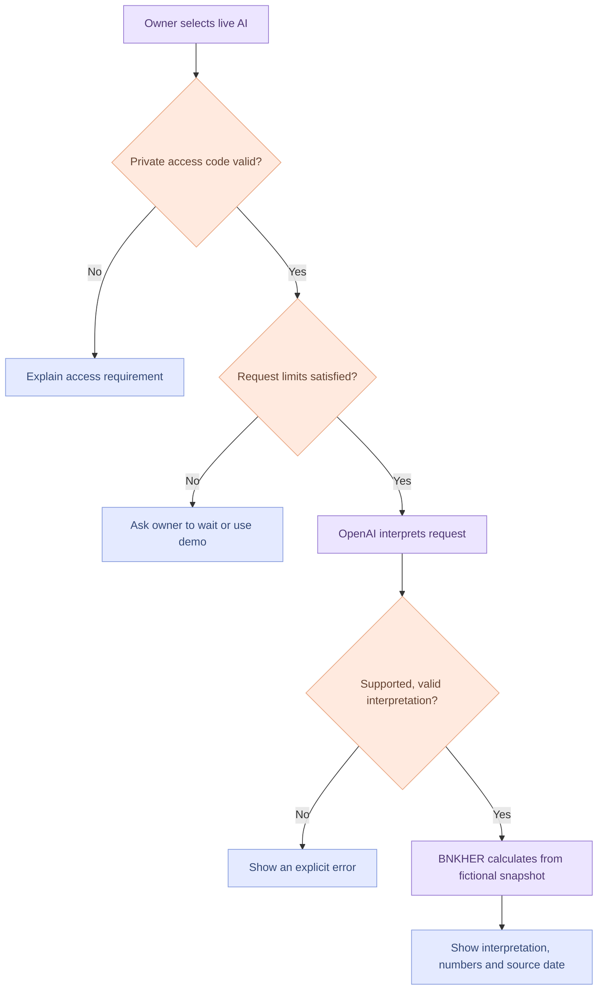

# Grounded AI assistant: version 0.2

## Implemented behavior
The optional backend calls OpenAI’s Responses API with a strict `route_question` function schema. The model interprets one of seven supported request categories and a purchase amount. BNKHER validates the returned structure and uses its integer-cent engine to calculate the result. Server-authored answer templates present the numbers and boundaries. The model does not write the financial explanation or decide eligibility.

This provides natural-language interpretation beyond the regex demo, including number words and follow-ups when the model interprets them correctly. Those capabilities need the optional real-model evaluation; mocked integration tests cannot establish interpretation quality.

The default pinned model is `gpt-5.4-mini-2026-03-17`; `OPENAI_MODEL` may be set to another compatible model. See the [official model documentation](https://developers.openai.com/api/docs/models/gpt-5.4-mini) and [function calling guide](https://developers.openai.com/api/docs/guides/function-calling).

## Request flow

## Data and access
- No API key is delivered to the browser. `OPENAI_API_KEY` remains a server environment variable.
- Live AI also requires an application access code (`AI_ACCESS_TOKEN`, at least 24 characters). It is distinct from the OpenAI API key and entered in the UI only by someone allowed to use this private AI demo.
- The backend serves the interface and API on the same origin. There is no broad CORS endpoint, and cross-origin browser requests are rejected.
- A request sends the current question, up to six recent chat messages, and validated demo scenario settings to the backend. OpenAI receives the question/history for interpretation; financial calculations use the server’s fictional snapshot. Client-supplied account balances cannot replace it.
- The UI discloses transmission before live mode is selected. Use fictional information only. An application access code protects AI access; it is not identity-based user authentication.
- `store:false` is set on model requests. This controls response storage, not an assertion of zero provider retention. Review the provider’s applicable data policy before using real records.
- Chat and access code remain in the current browser page; no localStorage, database or server chat persistence is implemented. Hosting infrastructure may still produce its own request logs.

## Limits and failures
Each process allows at most two concurrent AI requests, five requests per socket IP per minute, and 60 attempted AI calls per boot by default. Requests have a 16 KB body limit, 500-character current question limit, bounded history, a 15-second provider timeout and a 400-token model output cap. Failures do not leak provider responses or quietly turn into demo answers.

**These in-memory limits are not an account-level billing cap.** Restarting or adding hosting instances resets or multiplies their allowance. Some hosting proxies also share one socket IP across visitors. Keep this AI mode access-controlled for the first release. A broader public service needs identity-based access, shared durable quotas, billing monitoring and production operational controls.

## Verification status
22 automated engine/backend checks passed, including injected provider responses, malformed output, wrong access code, origin checks, allowance exhaustion, incomplete commitments and server-authoritative data. The UI checks passed for both the static demo and an injected-provider backend, including mode switching and failed credentials.

**No real OpenAI call was made during this build.** `tests/live-eval.mjs` contains eight optional billed intent evaluations to run after private credentials are configured. Model understanding, provider account access, real latency and a hosted live-AI deployment remain unverified.
