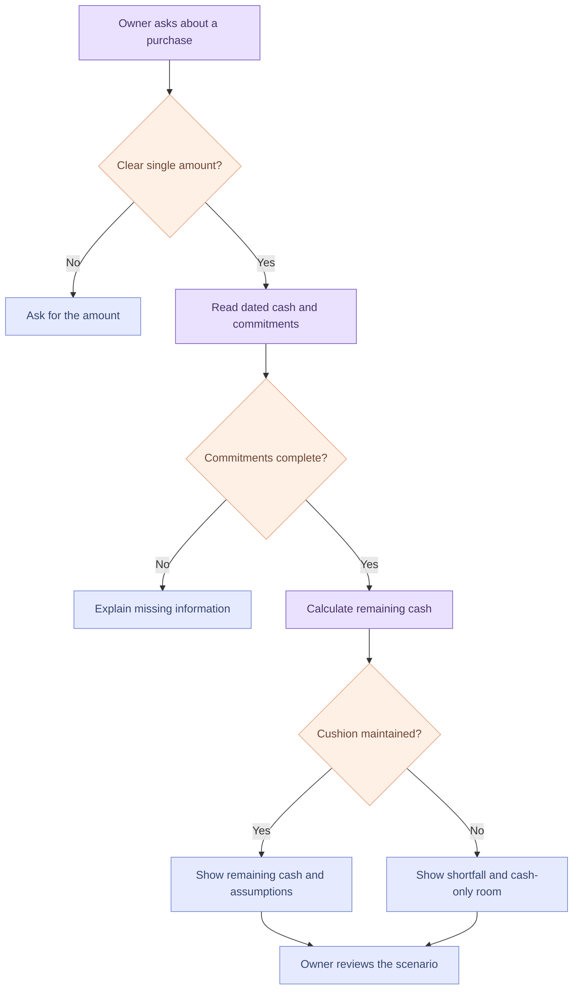

# A purchase, explained

Expected income is excluded unless the owner explicitly selects that scenario. A scenario never authorizes a transaction. In the prototype, routing is rule-based; this flow describes the intended reasoning boundary for a future grounded AI assistant as well.
